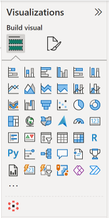

# Sample Denodo AI PowerBI Widget

This repository contains the source code to create a sample PowerBI application Widget that communicates with Denodo Gen-AI API SDK.

 

The **Denodo AI PowerBI Widget** is a sample custom visual for Power BI allowing users to pose report-related questions directly to Denodo within the Power BI environment. 

> **Note**: This code has not been fully tested and is not ment to be used in production. It is provided as it is, to be used as a starting point to help developers to create their own Widget.

## Introduction

To get started, you can just test the sample Denodo PowerBI AI Widget, by directly go to [PowerBI setup section](#import-denodo-ai-powerbi-widget-in-powerbi). 

> **Note:** Ensure that you have the right SSL certificate configures otherwise read the section [here](#ssl-certificate-configuration)

## Software requirement

* **denodo-ai-sdk** https://github.com/denodo/denodo-ai-sdk
* **Node.js** from [nodejs.org](https://nodejs.org/)
* **pbiviz** the Microsoft’s command-line tool [power-bi/developer/visuals](https://learn.microsoft.com/en-gb/power-bi/developer/visuals/environment-setup?tabs=desktop#install-pbiviz)

## Denodo AI SDK Install

The user manual for the Denodo AI SDK is available in the [Denodo Connects documentation section](https://github.com/denodo/denodo-ai-sdk#:~:text=in%20the%20Denodo%20Connects%20documentation%20section).

> **Important :** make sure you install the SDK API with **HTTPS enabled**

## SSL Certificate Configuration

> You will need to obtain from your certificate authority **(CA)** a valid certificate **(.crt)** and key **(.key)** for your Denodo AI SDK host server.

> Alternatively if you would like to use a self-signed certificate, your can follow the instruction [here](./README_SSL_Config.md)

**Confirgure HTTPS in Denodo AI SDK**
Navigate to Your Project Folder
Modify sdk_config file to set path for SSL certificate and key. **The path is relative to the Denodo AI SDK root folder**.

```
AI_SDK_SSL_CERT = "server.crt"
AI_SDK_SSL_KEY = "server.key"
```

## Setup & Install
### 1. Install Node.js

Ensure Node.js is installed on your machine. If not, download and install it from [Node.js official website](https://nodejs.org/).

### 2. Install PowerBI Visualization

The pbiviz tool compiles the visual source code for Power BI projects into a zipped package (pbiviz file) containing all scripts and assets.

```shell
npm i -g powerbi-visuals-tools@latest
```

### 3. Install Node.js project dependencies  
Navigate to the project root folder and install dependencies:
```shell
npm install
```

#### Install Power BI Visual Tools
```shell
npm install -g powerbi-visuals-tools
```

#### Built the Denodo AI PowerBI Widget
```shell
pbiviz package
```

**Note:** you'll find the build packaged **.pbiviz** file under the `/dist` folder

## Import Denodo AI PowerBI Widget in PowerBI

If you chose to use the PowerBI Widget provided by default and that you can find here [Denodo_AI_PowerBI_Viz.x.x.x.pbiviz](./Denodo_AI_PowerBI_Viz.0.3.0.0.pbiviz), the default Denodo AI SDK host name is **denodo-ai-sdk.api** on port **8008**.

* Go on the right-hand side to `Visualizations/Build Visual` click on the **...**
* Click `Import a visual from a file`
* Select the `Denodo_AI_PowerBI_Viz.x.x.x.pbiviz` file
* A Denodo icon appears, you can drag and drop the icon to add the visual in your dashboard

**Optional:**
It is possible to filter the question to the Denodo AI SDK to only answer question on a restricted set of data products related to your Dashboard visualization.

In order to implement views filtering, you need to:
* create a custom column named **used_tables** in the data source table you are using
* Configure the value of the `used_tables` column with  a semi-colon separated list of views and filter as follows `used_tables = "vdb.view1 with filters column1 = value1, vdb2.view2 with filters column2 = value2_1 or value2_2"`


