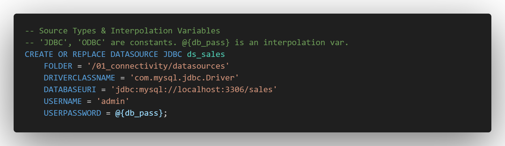
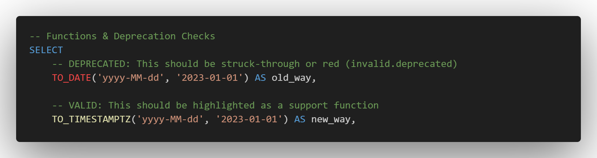

# Denodo VQL Syntax Highlighting for VS Code

This extension provides highly optimized syntax highlighting for `*.vql` files in VS Code, specifically targeting **Denodo 9** capabilities. In the future, we plan to include semantic token functionality for context-based highlighting.

## Features

### **Rich Syntax Highlighting for Denodo 9:**



### **Built-in Deprecation Warnings:**



1. **Syntax Highlighting (Coloring)**
    - **Keywords & DDL:** Colors `CREATE`, `ALTER`, `CONTEXT`, `WRAPPER`, etc.
    - **Denodo Native Types:** Colors `TIMESTAMPTZ`, `INTERVALYEARMONTH`, `REGISTER`, etc.
    - **Advanced Functions:** Fully supports Denodo 9 AI & Embedding functions (`EMBED_AI`, `CLASSIFY_AI`), Spatial functions (`ST_GEOMETRYTYPE`), and standard VQL functions (`GETVAR`).
    - **Variables:** Colors interpolation variables like `@{my_var}` distinctively.
    - **Comments:** Colors both Denodo-style `#` and standard SQL `--` comments correctly.
2. **Deprecation Warnings**
    - If a user types `TO_DATE`, it will be colored as `invalid.deprecated` (usually struck-through or red), visually signaling that they should use `TO_TIMESTAMPTZ` instead.
3. **Language Configuration**
    - **Comment Toggling:** `Ctrl + /` works correctly (inserts `#`).
    - **Bracket Matching:** Clicking near a `(` highlights the matching `)`.
    - **Auto-Closing:** Typing `[` automatically inserts `]`.

## Requirements

- VS Code **1.90.0** (May 2024 Release) or newer.

## Installation

You can install this extension directly from within VS Code or via the standard command line tools.

**Method A: Visual Studio Code**
1. Open VS Code and navigate to the **Extensions** view (`Ctrl+Shift+X` or `Cmd+Shift+X`).
2. Search for **"VQL"** or **"Denodo VQL"**.
3. Locate this extension in the list and click **Install**.

**Method B: Command Palette**
1. Press `Ctrl+P` (or `Cmd+P` on Mac) to open the Quick Open dialog.
2. Paste the following command and press Enter:
   `ext install denodo.vql-vscode`

**Method C: The Terminal**
If you prefer the command line, run:
```bash
code --install-extension denodo.vql-vscode
```

## References Used

[Virtual DataPort VQL Guide](https://community.denodo.com/docs/html/browse/latest/en/vdp/vql/index)

## Release Notes

1.0.1
Initial release. Please refer to the CHANGELOG for details.

## Author
Created and maintained by **[Jason Sandidge](mailto:jsandidge@denodo.com)**.

## License
This project is licensed under the [MIT License](LICENSE) - see the LICENSE file for details.