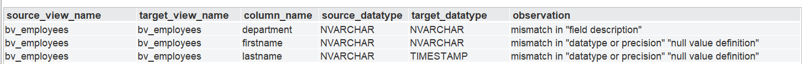
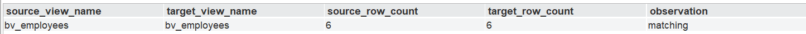
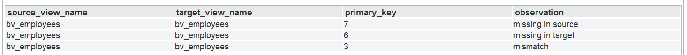

# Denodo ViewCompare

# Introduction

Denodo periodically releases both major and minor updates to its platform. During migrations—whether between major versions or incremental updates—customers are required to perform thorough testing to ensure consistency and reliability across environments. To facilitate and accelerate this process, the Denodo ViewCompare has been developed to identify differences in both metadata and data across Denodo environments.

The framework enables comparison of view definitions (metadata) as well as the underlying data, helping users detect discrepancies that may arise during migration. It is designed to provide detailed insights, including record-level differences, for a specified set of views across different versions.

In addition to detailed comparisons, the framework offers flexibility by allowing users to perform basic validation checks or opt for more granular, record-level analysis based on their requirements. This adaptability ensures that the framework can cater to varying levels of testing depth.

The Denodo ViewCompare can be deployed on any Denodo instance and configured to connect to both source and target environments. This allows users to perform comprehensive validation and View validation testing across different systems in a centralized and efficient manner.

---

# Scope

The **Denodo ViewCompare** is designed to assist customers in accelerating the testing process (limited to comparing the views) during migrations to newer Denodo versions or when applying platform updates. It provides a foundational setup that enables efficient comparison of views across Denodo environments, whether within the same server or across different servers.

The framework supports the following types of comparisons between two Denodo environments:

## 1. Metadata Comparison

Evaluates differences in view definitions, including schema structure, field names, data types, and more.

## 2. Row Count Comparison

Compares the total number of records returned by each view to identify any discrepancies in data volume.

## 3. Row-Level Data Comparison

Performs detailed comparison of the actual data returned by the views. Helps identify mismatches at the record level, enabling precise validation of data consistency.

# Key Configuration Concepts

The Denodo ViewCompare solution must be configured within a Denodo V9 instance. The overall setup is organized into four key components (or “tiles”), each representing a specific role in the framework:

## 1. Host VDP Server

- The Denodo server where the Denodo ViewCompare is deployed and executed.  
- This instance orchestrates the comparison process between environments.  
- The host must be a Denodo V9 server, and it is recommended that the host be a non-production server (such as a Sandbox) to minimize operational impact.  
- A dedicated Host server connects to both the Source and Target VDP servers.  

## 2. Source VDP Server

- Represents the existing or current Denodo environment.  
- Provides the baseline against which the target environment is validated.  

## 3. Target VDP Server

- Refers to the new or upgraded Denodo environment.  
- This environment is compared against the Source to identify discrepancies.  

## 4. Report Tables

- A relational database (RDBMS) used to store the results generated by the Denodo ViewCompare.  
- The stored results remain available until the next execution cycle.  
- During each execution, existing data is cleared using a truncate operation and reloaded with the latest results. This approach ensures that only the most recent execution data is retained.

---

# Prerequisites

The following prerequisites must be fulfilled before setting up the framework:

## 1. Relational Database

- A relational database must be available to store the output generated by the Denodo ViewCompare.  
- Ensure that the database is accessible from the environment where the framework will be executed.  

## 2. Python Environment

- Python version **3.10 or later** must be installed on the machine where the framework is being configured (Host VDP server).  
- Additionally, the required Python library **JayDeBeApi** must be installed to enable JDBC connectivity from the Python script.  

## 3. Denodo Connect Component

- The SSH Custom Wrapper (Denodo Connect component) must be properly configured in the Denodo instance where the framework will be deployed( Host VDP Server).
- This component is required to facilitate remote execution of scripts via SSH.

## 4. SSH Server Setup

- An SSH server must be installed and running on the machine where the Python script is hosted (Host VDP server).
- Ensure that the server is properly configured to accept incoming connections from the Denodo environment.

## 5. Port and Connectivity:
- For the Denodo ViewCompare to successfully communicate with both the Source and Target VDP servers, it is essential that these servers are reachable from the Host VDP server over the network. Specifically, the Host VDP server must have proper connectivity to the Source VDP server and Target VDP server and port 9999 (the default VDP port) should be open and accessible on both ends. The SSH Server port number (default is 22) should also be open and accessible from the Host VDP server.

## 6. Primary key for Row-Level Data Comparison:
- For the Row-Level Data Comparison to function accurately, it is essential that the views being compared contain a column that uniquely identifies each record. This unique identifier ensures precise matching of rows between the Source and Target datasets during comparison. While this field does not need to be explicitly defined as a primary key within Denodo, it must consistently contain unique, non-null values across the dataset to avoid mismatches or incorrect comparison results.

---

# Setup and Configuration of Denodo ViewCompare

The Setup of Denodo ViewCompare is done in the Host VDP Server. Follow the steps outlined in each of the sections below. 

## Report Table

### 1. Select a Supported Database

- Choose any JDBC-supported relational database where the testing results will be stored.
- Ensure that the database is accessible from the Denodo environment (Host VDP server).

### 2. Execute the Appropriate database DDL Script

- Navigate to the /report_table_DDL folder containing DDL scripts for multiple database systems.
- Select the script corresponding to your chosen database (e.g., SQL Server, Oracle, or MySQL.).
- Execute the selected DDL script to create the required report tables in the database of your choice.

Note: We have currently provided DDL scripts for SQL Server, MySQL, and Oracle. If you require creating the report tables in a different database, we kindly request you to use these DDLs as a reference and make the necessary modifications to suit your target system.# Importing VQL Files

## Importing VQL Files:

Within the provided driver package, you will find two distinct VQL files required for the setup. Follow the steps below to complete the import process:

### 1. Download and Extract Files

To begin, please download the ZIP file that corresponds to the database in which the report tables were created.

`VQL/ViewCompare_vql_export_report_views_<target_rdbms_database>.zip`

Once downloaded, extract its contents to a folder on the Host server.

### 2. Update the Properties File

Locate the file:

`ViewCompare_vql_export_report_views_<target_rdbms_database>.zip`

Update it with the appropriate configuration values:

- Modify the parameters `<JDBC_URI>`, `<USERNAME>`, `<CATALOGNAME>`, and `<SCHEMANAME>` so that they correctly point to the data source where the report tables have been created.

- Encrypt the source connectivity password using the appropriate script:

  - **On Windows:**  
    `DENODO_HOME/bin/encrypt.bat`

  - **On Linux:**  
    `DENODO_HOME/bin/encrypt.sh`

- After encryption, replace the `<PASSWORD>` parameter in the properties file with the encrypted value.

### 3. Import the VQL:

Import the **ViewCompare_vql_export_report_views_<target_rdbms_database>**.vql file along with the updated properties file to ensure the configuration is applied correctly.

Finally, download and import the [**ViewCompare_vql_export.zip**](VQL/ViewCompare_vql_export.zip) file. During the import process, use the password **admin** when prompted.

### Setup for Other Databases

> **Note:** If the report tables were created in a database other than **MSSQL**, **Oracle**, or **MySQL**, please follow the steps below to ensure proper integration with the framework.

#### Steps to Follow

1. **Create a Datasource Connection**
   - Set up a new datasource connection in the `vdb_viewcompare` VDB.
   - This connection should point to the database where the report tables were created.

2. **Create Base Views**
   - Once the connection is established, create base views on top of the report tables created in the previous step.
   - Ensure that the base views strictly follow the required naming standards:

     | Table Name              | Base View Name              |
     |------------------------|-----------------------------|
     | metadata_comparison    | bv_metadata_comparison      |
     | row_count_comparison   | bv_row_count_comparison     |
     | checksum_comparison    | bv_checksum_comparison      |

#### Important

Following the above naming conventions is mandatory. This ensures that the framework can correctly identify and utilize the views without any issues. 

# Data Source Configuration

Please configure the following data sources to ensure proper connectivity with the respective environments:

## 1. Source Denodo Server Connection

- **ds_source_denodo_server**: Configure this data source to establish a connection with the **Source VDP server**.

- Ensure that all connection parameters (such as host, port, database name, and credentials) accurately reflect the Source VDP server.

- Provide appropriate values for the parameters as outlined below:

  - **Host** – Specify the hostname of the Source VDP server.  
  - **Port** – Specify the port number on which the Source VDP server is running.  
  - **Database Name** – Specify the name of the Virtual Database used to establish the connection.  

  > The above parameters must be configured within the JDBC URI.

- **Credentials** – Provide valid username and password details in the user configuration to authenticate and access the Source VDP server.

---

## 2. Target Denodo Server Connection

- **ds_target_denodo_server**: Configure this data source to connect to the **Target VDP server**.

- Ensure that all connection parameters (such as host, port, database name, and credentials) accurately reflect the Target VDP server.

- Provide appropriate values for the parameters as outlined below:

  - **Host** – Specify the hostname of the Target VDP server.  
  - **Port** – Specify the port number on which the Target VDP server is running.  
  - **Database Name** – Specify the name of the Virtual Database used to establish the connection.  

  > The above parameters must be configured within the JDBC URI.

- **Credentials** – Provide valid username and password details in the user configuration to authenticate and access the Target VDP server.

## 3. SSH Script Execution Configuration

- The **ds_ssh_script_executor** should be configured with the required connection details to establish an SSH session with the **Host VDP Server** where the Python script will be executed.

- This configuration enables secure remote execution and should include the following parameters:

  - **Hostname or IP Address** – The address of the target machine  
  - **SSH Port** – Default is 22 (unless customized)  
  - **Username** – A user with sufficient privileges to execute the script  
  - **Password** – Or relevant authentication method, if applicable  

- Ensure that the **Host VDP Server** is reachable over the network and that SSH access is properly enabled and permitted for the provided credentials.

---

# Python Script Setup and Configuration

A Python script is used to determine the checksum of each record in both the **Source VDP server** and **Target VDP server**, and to perform row-level data comparison.

Follow the steps below to configure the Python script:

## 1. Copy the Python Script

- Copy the file:

  `python_script/checksum_py_script.py`

  to a desired directory on the **Host VDP Server** where it will be executed.

- Ensure that the selected directory has the necessary permissions for script execution.

## 2. Update Connection Parameters

- Open the Python script and update the following parameters to establish JDBC connectivity with the Denodo Virtual DataPort server (Host VDP server):

  - `JDBC_DRIVER`  
  - `JDBC_URL`  
  - `USERNAME`  
  - `PASSWORD`  

- These parameters should be configured with appropriate values corresponding to the Denodo environment to ensure successful connectivity.

## 3. Configure JDBC Driver Path

- The `JAR_PATH` parameter specifies the location of the JDBC driver required for Denodo connectivity.
- Copy the `denodo-vdp-jdbcdriver.jar` file from the following directory:  
  `DENODO_HOME/lib/extensions/jdbc-drivers/vdp-9/denodo-vdp-jdbcdriver.jar`
- Place this `denodo-vdp-jdbcdriver.jar` file in the same directory as the Python script (or in another accessible location).

---

## 4. Update JAR Path in Script

After placing the JDBC driver, update the `<JAR_PATH>` parameter in the Python script to point to the directory where the JAR file is located.

---

## Configuring the Python Script Location in Design Studio

To ensure that the Python script can be executed correctly, its location must be configured within the corresponding base view in Design Studio.

### Steps:

1. In Design Studio, navigate to the base view named `bv_ssh_python_script_executor`.
2. Open the view and go to **Edit → Source Refresh**.
3. Provide the full path to the directory where the `checksum_py_script.py` file has been placed.

> **Note:** Ensure that the specified path is accessible from the Host VDP server.

## Executing Your Tests

The execution steps will outline details about each validation performed as part of the Denodo ViewCompare.  
Follow the steps below, which include specific instructions on utilizing the relevant PL/SQL stored procedures for each check.

---

### Test Summary

The table below summarizes the syntax and expected results from the tests:

| Test Name              | PL/SQL Procedure / Final Executable Syntax                                                                 | Parameters                                                                                                                                                                                                 | Result View              | Decoding the Results |
|-----------------------|------------------------------------------------------------------------------------------------------------|------------------------------------------------------------------------------------------------------------------------------------------------------------------------------------------------------------|--------------------------|----------------------|
| Metadata Comparison   | `metadata_check(source_dbname, source_view_name, target_dbname, target_view_name)`                        | `source_dbname` (Name of the source database)   `source_view_name` (Name of the source view)   `target_dbname` (Name of the target database)   `target_view_name` (Name of the target view)     | `bv_metadata_comparison` | Refer to Appendix A  |
| Count Check           | `count_check(source_dbname, source_view_name, target_dbname, target_view_name)`                           | `source_dbname` (Name of the source database)   `source_view_name` (Name of the source view)   `target_dbname` (Name of the target database)   `target_view_name` (Name of the target view)     | `bv_row_count_comparison`| Refer to Appendix B  |
| Checksum Comparison   | `SELECT * FROM bv_ssh_python_script_executor WHERE source_dbname, source_view_name, target_dbname, target_view_name, source_primary_key_field, target_primary_key_field` | `source_dbname` (Name of the source database)   `source_view_name` (Name of the source view)   `target_dbname` (Name of the target database)   `target_view_name` (Name of the target view)   `source_primary_key_field` (Primary key field in the source view)   `target_primary_key_field` (Primary key field in the target view)    | `bv_checksum_comparison` | Refer to Appendix C  |

---

> **Note:** Ensure all required parameters are passed correctly to avoid execution errors.

## Appendix A

### Summary of Observations with Explanations

| Category | Details |
|----------|---------|
| datatype or precision | Mismatches in `column_vdp_type`, `column_jdbc_type`, `column_size`, etc. |
| type, decimal, column radix, primary key definition, null value definition, field description, autoincrement definition | All these values are self-explanatory. For additional information, refer to the `GET_VIEW_COLUMNS` documentation. |

---

## Appendix B

### Summary of Observations with Explanations

| Result Type | Description |
|-------------|-------------|
| Matching    | Row counts are equal in both views |
| Mismatch    | Row counts differ between source and target |

---

## Appendix C

### Summary of Observations with Explanations

| Observation Type | Description |
|------------------|-------------|
| Missing in Source | Records present in target but not in source |
| Missing in Target | Records present in source but not in target |
| Mismatch          | Records exist in both but data differs |

---

> **Note:** These observations help identify discrepancies in row counts and data consistency between source and target systems.

# Sample Execution Timings for Checksum Comparison

| Number of Rows | Number of Fields | Time Taken   |
|----------------|------------------|--------------|
| 100,000        | 100              | 40 seconds   |
| 500,000        | 100              | 120 seconds  |
| 1,000,000      | 100              | 800 seconds  |

## Limitations and Important Considerations

- Currently, the framework accepts input as a **single view** (source and target each) for comparison.  
  To preserve server overhead, the framework executes checks for one view at a time.

- For **Count Check** and **Metadata Comparison**, if the virtual database is provided incorrectly, the stored procedure will fail stating that the virtual database is missing.  
  If the view names are incorrect, it is handled as an exception and the output will reflect the same in the respective output views.

- For **Metadata Comparison**, if there are multiple mismatches for a single column, they will be shown as multiple messages enclosed in double quotes.  
  Example: `"mismatch in 'datatype or precision'"`, `"null value definition"`.

---

## Denodo ViewCompare License

This project is distributed under **Apache License, Version 2.0**. 

See [LICENSE](LICENSE)

## Denodo ViewCompare Support

This project is supported by **Denodo Community**. 

See [SUPPORT](SUPPORT.md)

## Authors

- Developed by: Dineshraja Annadurai, Muthu Rajesh Subramaniam
- Contact: dannadurai@denodo.com, msubramaniam@denodo.com