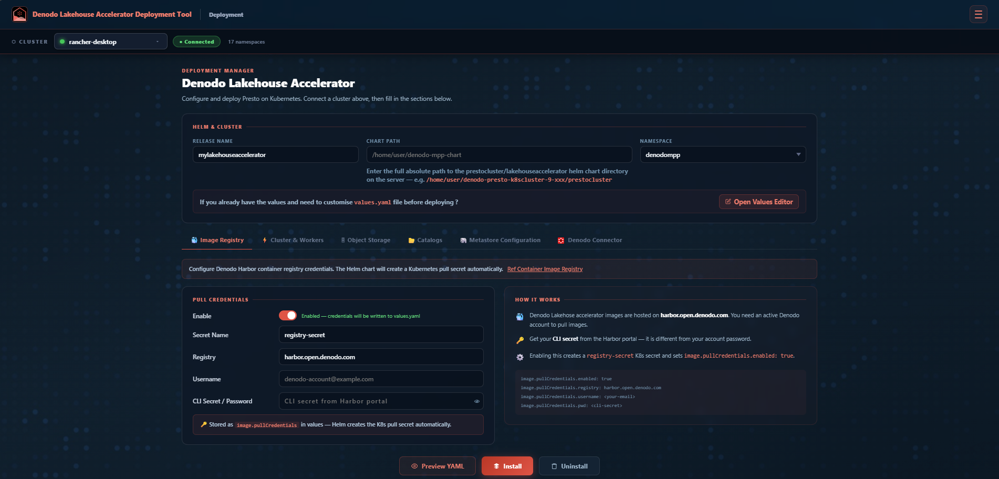
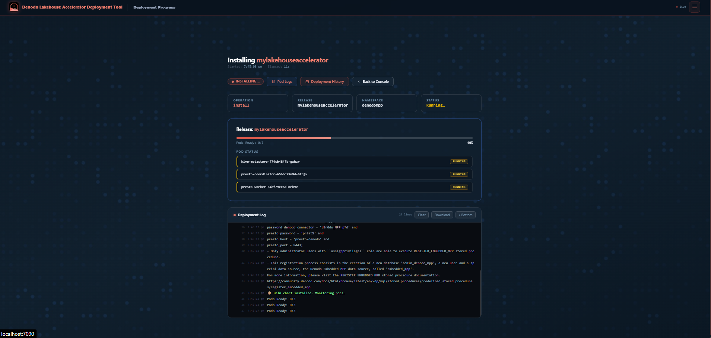
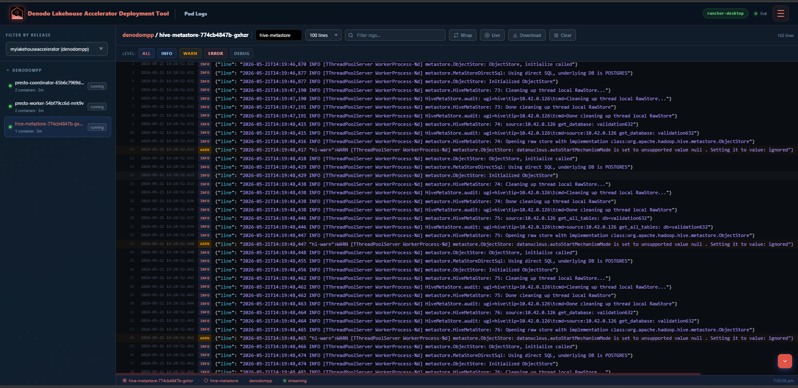
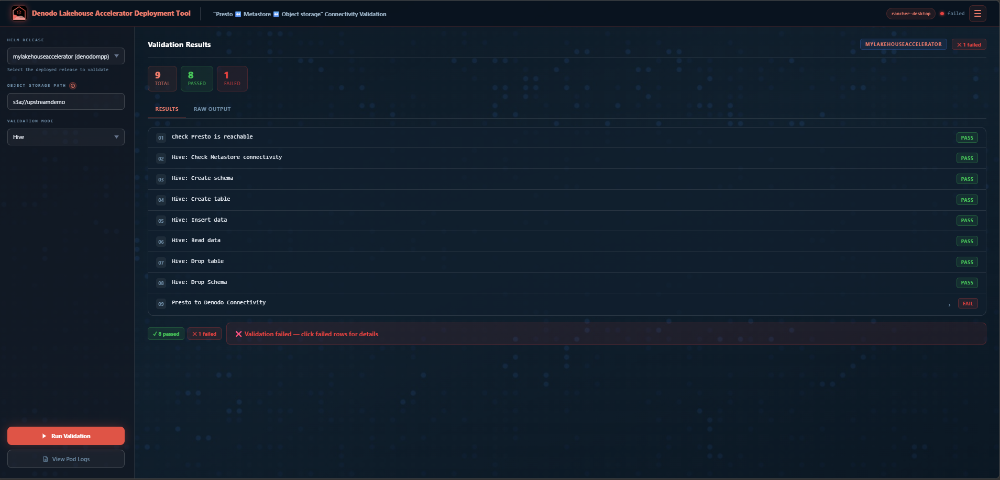
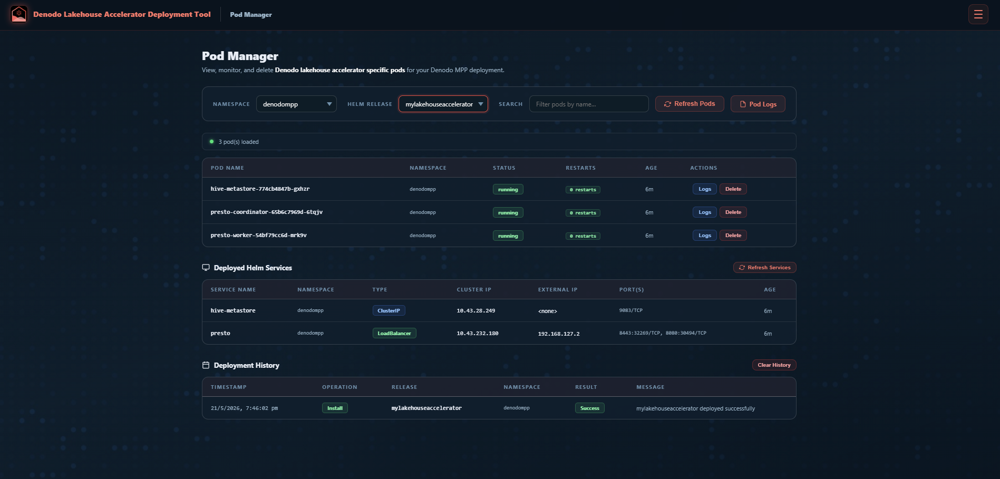
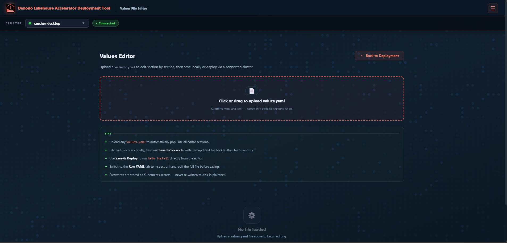

# Denodo Lakehouse Accelerator Deployment Tool

A web-based platform for deploying and managing Denodo Lakehouse Accelerator clusters on Kubernetes through an intuitive user interface, eliminating the need for command-line expertise

---

## What This Tool Does

This tool lets you:
- Deploy the Denodo Lakehose Accelerator cluster into Kubernetes with a few clicks
- Monitor the deployment progress in real time
- View live logs from any pod in your MPP cluster
- Important Connectivity checks from Presto
- Edit your existing `values.yaml` file visually and deploy

---

## Prerequisites

Before running this tool, make sure the following are installed on your machine:

| What | Why you need it |
|------|----------------|
| **Python 3.10+** | Runs the tool |
| **kubectl** | Talks to your Kubernetes cluster |
| **helm** | Deploys the Denodo MPP chart |
| **Access to a Kubernetes cluster** | Where Denodo MPP will be deployed |
| **Denodo MPP Helm chart folder** | The chart files to deploy from |

### Install Python packages
```bash
cd <PROJECT_FILE_HOME>
pip install -r requirements.txt
```

### Start the tool
```bash
cd <PROJECT_FILE_HOME>
python app.py
```
Then open your browser and go to **http://localhost:7090**

You can change the port by modifying the **APP_PORT_NUMBER** variable in "app.py" file

---

## Pages

### 🏠 Deployment Console
**The main page.** This is where you set up and launch a deployment.

- Connect to your Kubernetes cluster using the cluster selector at the top
- Fill in your release name, chart location, namespace, and MPP engine settings
- Click **Install** to deploy, or **Uninstall** to remove an existing release
- A progress bar at the bottom shows what is happening in real time



---

### 📊 Deployment Progress
**Watch your deployment unfold.**

- Shows a live progress bar from 0% to 100%
- Lists every pod being created and its current status
- Displays log messages as they come in
- Shows a clear success ✅ or failure ❌ message when done




---

### 📋 Pod Logs
**View live logs from any pod in your Lakehouse Accelerator cluster.**

- Pick any pod from the list on the left
- Logs stream live in the main panel
- Filter by log level: INFO, WARN, ERROR, DEBUG
- Search for any keyword within the logs
- Can also download the logs for troubleshooting



---

### 🔌 Connectivity Test
**All connectivity tests from the Presto server.**

- Select your deployed release
- Enter your storage path
- Click **Run Validation**
- See a clear pass ✓ or fail ✗ result with details
- This will helpful to ensure the Lakehouse accelerator is able to connect to object storage, hive metastore and Denodo Platform



---

### ⚙️ Pod  Manager
**Manage pods and Deployment History**

- Able to see the pod   `status` , `Logs` , `Delete`
- Track the Deployment history. History will be saved locally in `deploy_history.json`



---

### ⚙️ Values Editor
**Developer mode. Upload values.yaml > Validate > Make changes if any > `Deploy`**

- If you have already the `values.yaml` ? No need to deploy via Deployment page
- Upload any `values.yaml` file 
- Edit settings across organised tabs (Image, Workers, Storage, Catalogs, etc.)
- Download the updated file or deploy directly from this page




---

## 📚 Documentation

For detailed information on installation, configuration, and usage, refer to the full user manual:

👉[Denodo Lakehouse Accelerator Deployment Tool - User Manual](static/Denodo%20Lakehouse%20Accelerator%20Deployment%20Tool%20-%20User%20Manual.pdf)
---
## Quick Troubleshooting

**The cluster selector shows "Not Connected"**
→ Check that your `~/.kube/config` file exists and that you can run `kubectl get nodes` in your terminal.

**Test connectivity failed with file presto_connectity** 
→ Make sure to execute the python program from the HOME folder i.e, `mpp`.
→ Change the EOL conversion according to Unix. For that, open the script `templates/presto_validation.sh` in NotePad++ , `Edit > EOL Conversion > Unix` and save the file. 

**Install fails straight away**
→ Make sure the `chart path` you entered in `Deployment` tab is correct and the folder exists on this machine.

**Progress bar is stuck**
→ The deployment is still running. Large clusters can take 10–15 minutes. Check the Deployment Progress page for more detail.

**No logs appearing in the Pod Logs page**
→ Make sure a cluster is connected first. Go back to the Deployment Console and connect your cluster.

**Connectivity test returns an error**
→ Make sure the Presto coordinator pod is in Running state before testing. Check the Pod Logs page for any errors.


# Join the Denodo Community
- Star the repo
- Join the [Denodo Community](https://community.denodo.com/) and ask questions on the [Q&A](https://community.denodo.com/answers)
- Download [Denodo Express](https://community.denodo.com/express/download)
- Contributions are, of course, most welcome! 
- Track issues

## Denodo Lakehouse Accelerator Deployment Tool License
This project is distributed under **Apache License, Version 2.0**. 
See [LICENSE](LICENSE)

## Denodo Lakehouse Accelerator Deployment Tool Support
This project is supported by **Denodo Community**. 
See [SUPPORT](SUPPORT.md)

## Authors

- Developed by : Ramanathan Nagarajan , Narendiran Kumar 
- Managed by : Balaji Seetharaman