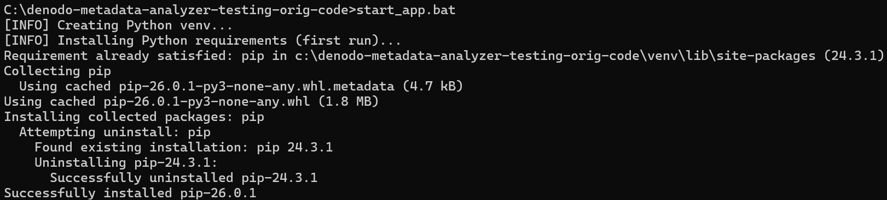
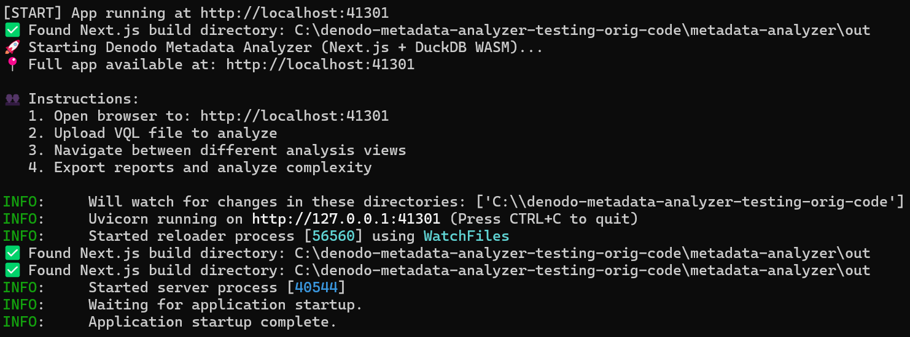
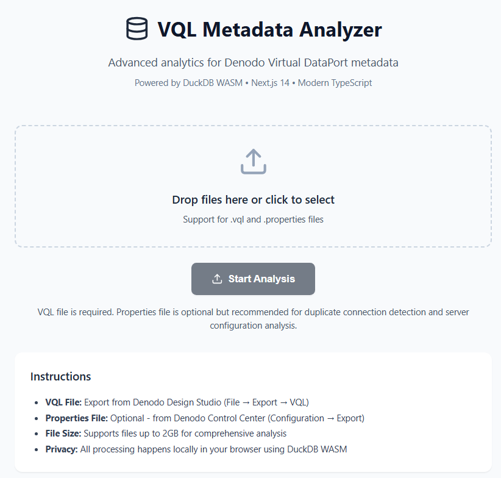
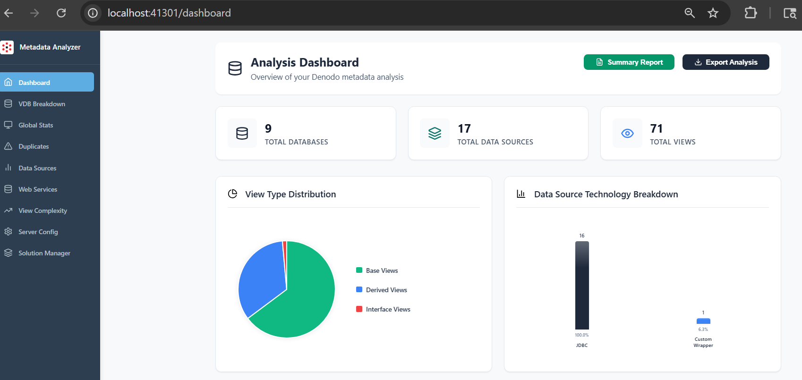

# Denodo Metadata Analyzer

Fast and comprehensive Denodo VQL metadata analysis tool with advanced view complexity scoring and configuration insights.

## 🚀 Quick Start

### Prerequisites
- **Python 3.7+** (tested with 3.12.3)
- **Windows** (for .bat launcher)

### Installation & Launch

1. **Download & Extract**
   ```bash
   git clone  --no-checkout https://github.com/denodo/denodocommunity-resources.git
   cd denodocommunity-resources
   git sparse-checkout init
   git sparse-checkout set tools/denodo-metadata-analyzer
   # OR download and extract the ZIP file

   cd denodo-metadata-analyzer
   ```

2. **Launch Application** (One Command!)
   ```bash
   start_app.bat
   ```


**That's it!** The script will automatically:
- ✅ Create Python virtual environment
- ✅ Install all required dependencies
- ✅ Launch the web application at `http://localhost:41301`



### What Gets Installed Automatically
The launcher installs these Python libraries:
- **FastAPI** - Web framework
- **SQLGlot** - SQL parsing & complexity analysis
- **Pandas** - Data processing
- **Uvicorn** - Web server

## 📋 Technical Architecture
- **Frontend**: Next.js 14 app (pre-built static files with App Router)
- **Backend**: Python FastAPI server
- **Database**: Client-side DuckDB WASM (no external database required)
- **Port**: 41301 

## 📊 How to Use

1. **Open your browser** to `http://localhost:41301`
2. **Upload your Denodo files**:
   - **VQL File** (.vql) - Your Denodo metadata export
   - **Properties File** (.properties) - Server configuration
   - **Solution Manager Export** (.json) - Solution Manager environment details (NEW!)



3. **Get instant insights** - Analysis results appear immediately with interactive dashboards



## ✨ Key Features

### 🔍 **Metadata Analysis**
- **Global Statistics** - Complete breakdown of databases, views, and data sources
- **View Type Distribution** - Base, derived, and interface views breakdown
- **Data Source Technology** - Technology stack analysis and breakdown of the data sources
- **Database Deep Dive** - Detailed per-database analysis with tabs for Data Sources, Views, Cache, and Associations
- **Solution Manager Integration** - Upload Solution Manager JSON exports to view environment configurations and deployment details

### 🧠 **Advanced Analytics**
- **View Complexity Scoring** - VQL complexity analysis of the denodo views with scoring range 0-100 
- **Duplicate Detection** - Find duplicate JDBC connections and redundant configurations
- **Security Analysis** - Admin role detection and privilege analysis

### ⚡ **Performance Insights**
- **Excel Memory Analysis** - Detect stream tuples configuration for Excel Data Sources
- **Caching Analysis** - View caching status and breakdown of cached views and databases
- **Configuration Optimization** - Server settings and JVM Configurations

### 📈 **Interactive Dashboard**
- **Real-time Analysis** - Instant results as you upload files with client-side processing
- **Visual Charts** - Pie charts, bar graphs, and detailed breakdowns
- **Export Capabilities** - Generate PDF reports and export CSV analysis data
- **Client-side Processing** - All data processing happens in your browser using DuckDB WASM - no server uploads required
- **Multi-file Support** - Upload and analyze VQL, Properties, and Solution Manager JSON files simultaneously

## 🔧 Troubleshooting

### Common Issues

**"Python environment setup failed"**
- Ensure Python 3.7+ is installed and accessible
- Try running: `python --version` or `py --version`
- Install Python from [python.org](https://python.org) if missing

**"Next.js app not built" Error**
- This indicates missing build files in `denodo-metadata-analyzer/out/`
- Contact support or pull the latest release

### 🧠 **Advanced Analytics**
- **View Complexity Scoring** - VQL complexity analysis of the denodo views with scoring range 0-100 
- **Duplicate Detection** - Find duplicate JDBC connections and redundant configurations
- **Security Analysis** - Admin role detection and privilege analysis

**Port 41301 Already in Use**
- Close other applications using this port
- Or modify the port in `python/view_complexity_server.py`

## 📝 Notes

- **First Run**: Takes longer due to dependency installation
- **Subsequent Runs**: Launch instantly
- **Data Privacy**: All analysis happens locally in your browser - no data sent to external servers
- **File Support**:
  - VQL files (.vql) from Denodo 7.0+
  - Properties files (.properties) from Denodo Platform
  - Solution Manager exports (.json) from Denodo Solution Manager
- **Technology Stack**: Next.js 14 + DuckDB WASM for blazing-fast client-side analytics
- **No Database Required**: All data processing happens in-browser using WebAssembly

# Join the Denodo Community
- Star the repo
- Join the [Denodo Community](https://community.denodo.com/) and ask questions on the [Q&A](https://community.denodo.com/answers)
- Download [Denodo Express](https://community.denodo.com/express/download)
- Contributions are, of course, most welcome! 
- Track issues

## Denodo Metadata Analyzer License
This project is distributed under **Apache License, Version 2.0**. 
See [LICENSE](LICENSE)

## Denodo Metadata Analyzer Support
This project is supported by **Denodo Community**. 
See [SUPPORT](SUPPORT.md)
